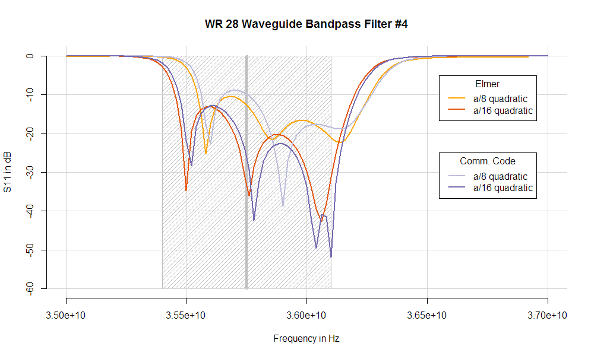
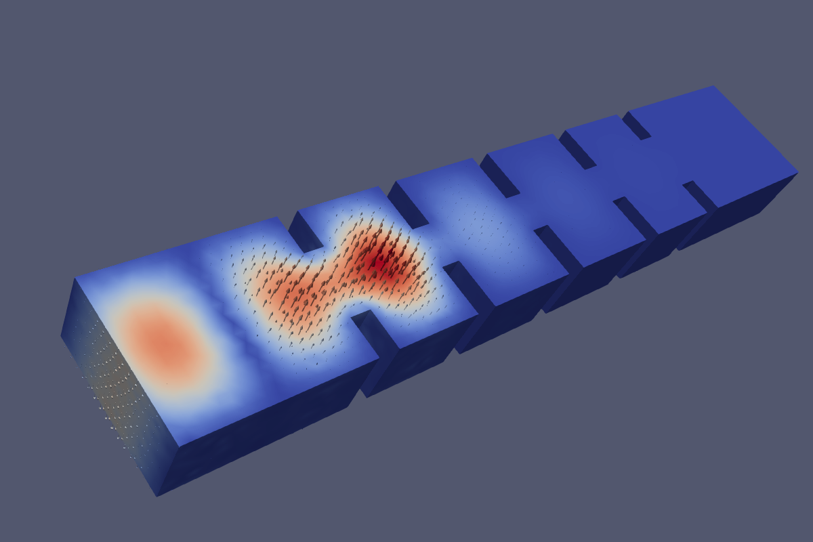

# Bandpass Filter 

This is a test case initiated by "Tom" at the Elmer discussion forum.
For details about the history of the case see:

http://www.elmerfem.org/forum/viewtopic.php?p=19791#p19791

- VectorHelholtzSolver used for harmonic electric field
- Sweeping over frequency is performed

