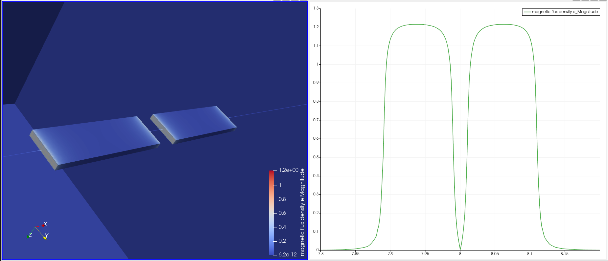

# Elmer Bar Magnets 3D
Example case for 3-D modelling of two co-axial bar magnets.

The model geometry is based on two bar magnets with dimensions 100mm (L), 5mm (H), and 30mm (W). 

This case came about from a [discussion](https://www.elmerfem.org/forum/viewtopic.php?t=8026) on the Elmer forum.

