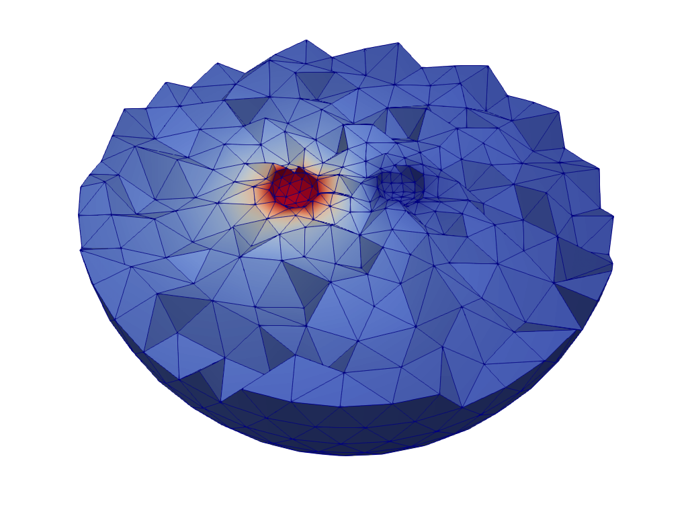
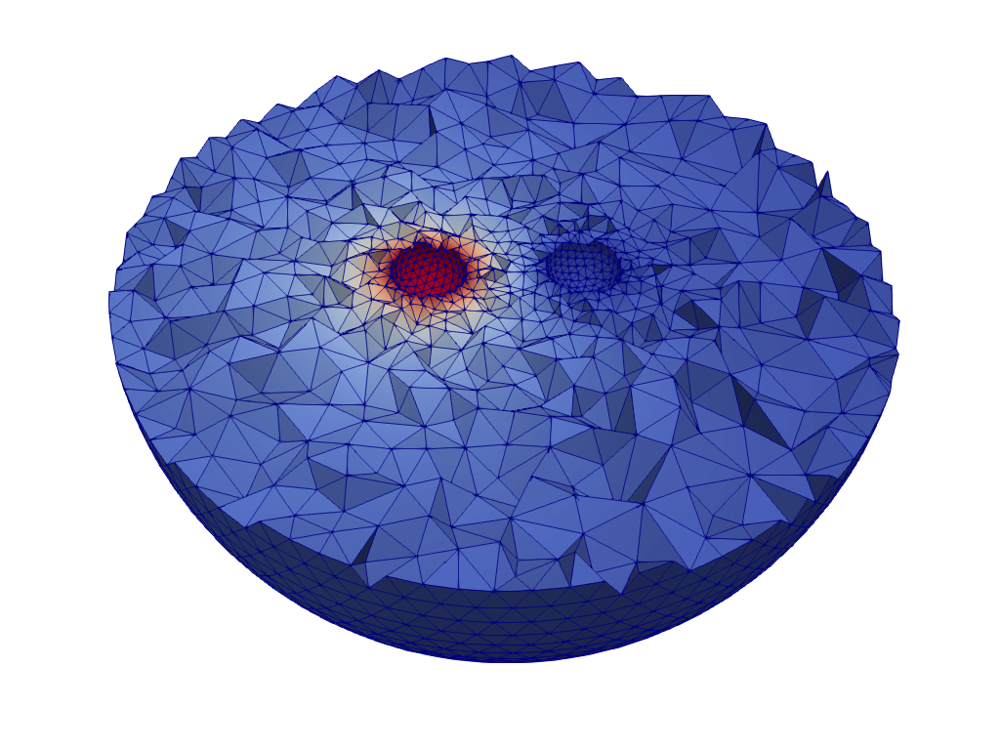
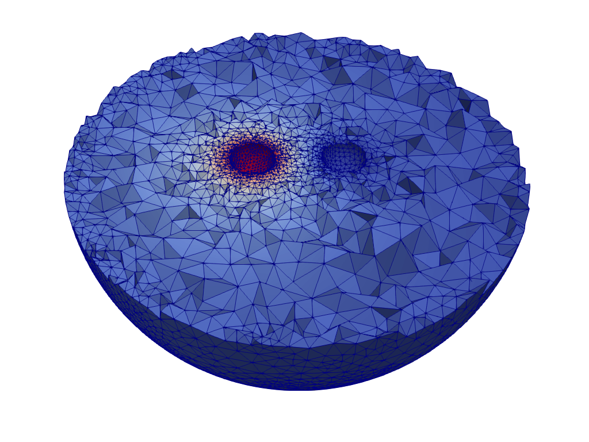
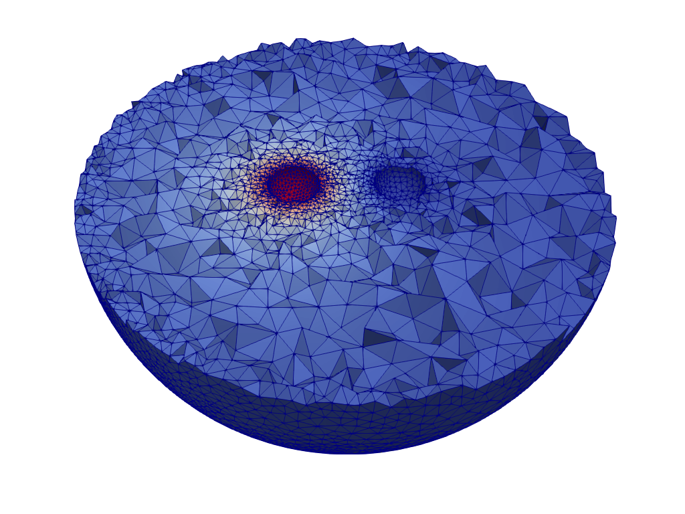
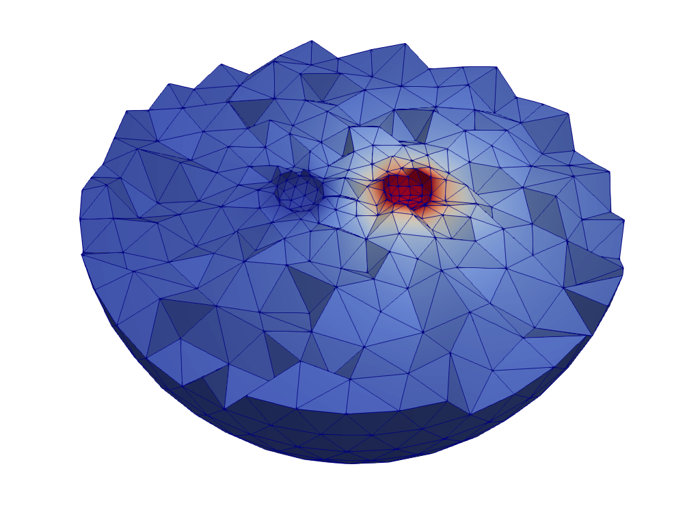
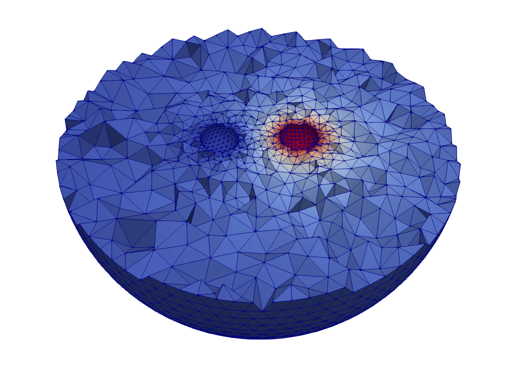
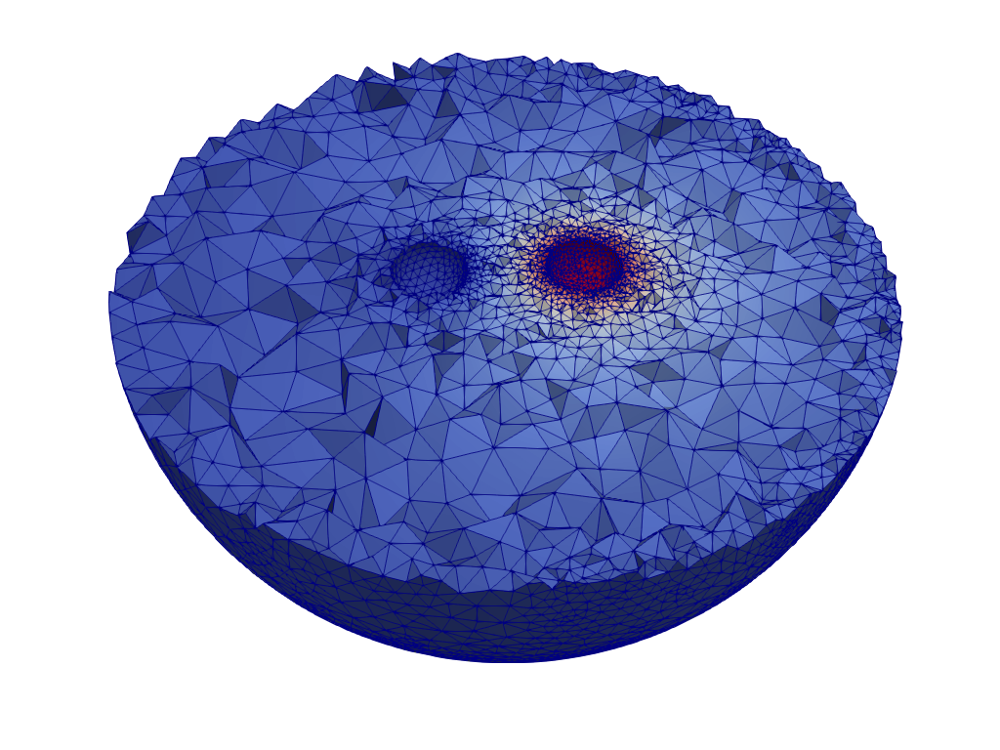
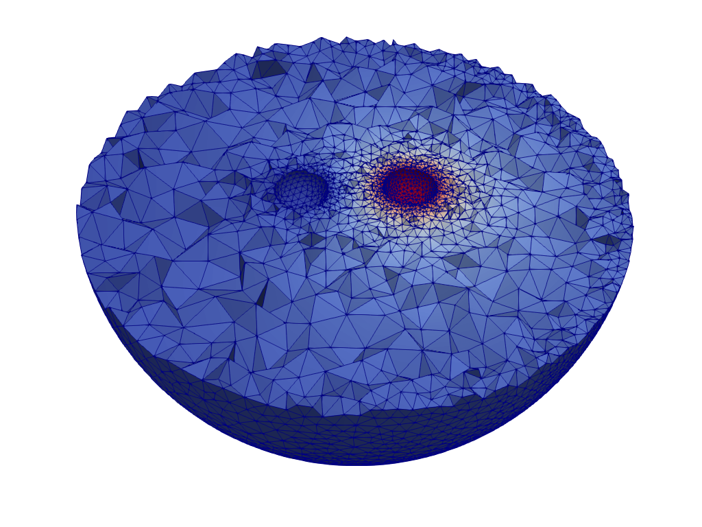

# Capacitance of two balls using adaptive mesh refinement

This is a test case demonstrating how to achieve optimal accuracy for capacitance matrix computation
using adaptive mesh refinement with the MMG3D library.

The original case is one of the tutorials of ElmerGUI, see the tutorial "Capacitance of Two Balls" in
ElmerGUI Tutorials and the original case in the repository:
* https://github.com/ElmerCSC/elmerfem-manuals/tree/main/tutorials-GUI-files/CapacitanceOfTwoBalls

Additionally the scaling of linear systems for this case has been studied here both for Lagrange and hierarchical p-elements:
* https://github.com/ElmerCSC/elmer-linsys/tree/main/Electrostatics/CapacitanceOfTwoBallsH
* https://github.com/ElmerCSC/elmer-linsys/tree/main/Electrostatics/CapacitanceOfTwoBallsP

This case collects together some of the best practices related to capacitance computation.
We list here some features that have been considered:
* Arbitrary adaptivity with p-element (optimal probably 2 or 3 order)
* Adaptive mesh refinement using MMG3D library and error estimators for p-elements
* Capacitance matrix is computed by the machinery initially created for constraint modes
* Restarting adaptivity when changing the capacitance matrix permutation
* Determination of spherical shapes in mesh
* Fitting geometry to curved shapes when using p-elements which is essential for accuracy
* Use of p-multigrid that utilizes the hierarchies generated by p-elements
* Run Control section used for capacitance matrix permutations allowing adaptivity and visualization in inner loops.
* Only half space is saved of the mesh for pretty visualization

To run the cases say:
>ElmerGrid 14 2 balls.msh -autoclean -out mesh   
>ElmerSolver case.sif

For reference this is the CapacitanceMatrix.dat with these settings:  
   5.0418163384591788        1.6712518805801200       
   1.6712518805801200        5.0419774005713753       

What could be further studied
* What is the optiomal p for obtaining the most accurate results in given time
* What is the effect of curved coordinates for the accuracy
* How do these strategies work for other more complicated cases

Below we provide a series of still pictures that depict the potential and
adaptive mesh refinements for two permutations (A and B). 

