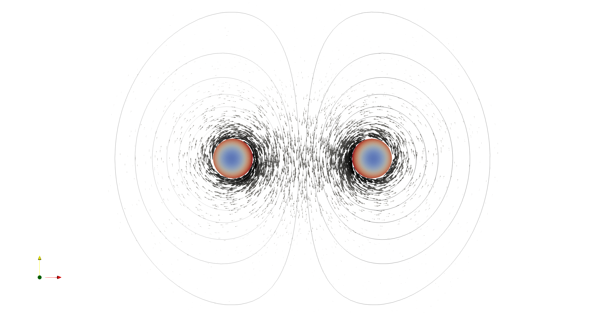

# 2D Massive Coil

This model shows how to model a 2D single-turn massive-coil. Each FEM round cross section is modeled as an ElmerComponent, which are connected in series using the CircuitBuilder

The model is solved as a transient and a harmonic problem, each in their respective directories. The voltage source is sinusoidal, excited at a frequency of 5kHz. Hence, skin and proximity effects can be observed. 

