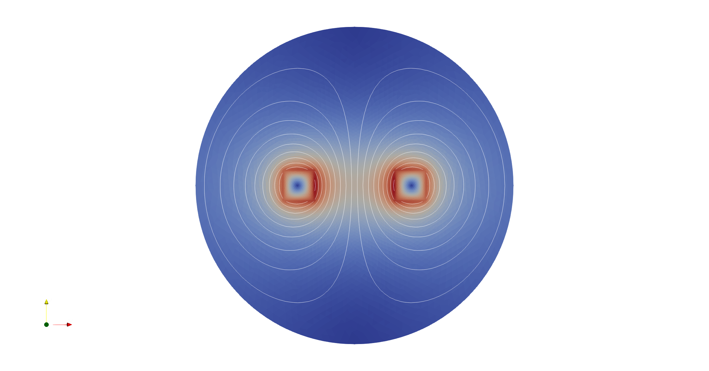

# 2D Stranded Coil

This models shows how to setup a stranded coil in 2D. The cross
section of the coil is squared. The voltage source is sinusoidal,
excited at 5kHz.

The model is solved for the transient and the harmonic case and are
stored in their respective directories.



# How to create the circuit?
The circuit is created using the CircuitBuilder and it's stored in the main.py file. To create or modify the circuit run the following command in terminal
```
$ python3 main.py

```

This will output a file with the extension .definition. This file contains the circuit definition, Body Force 1 and Component required by Elmer's .sif file. In these models the file is included in the .sif file as 

```
Include "<name_of_circuit>.definition"

```

## Transient Case

The general case is set up as a DC source. 

```
Body Force 1
  V1_Source = Variable "time" 
  	 Real MATC "V1"
End

```

 Adding time-dependencies to the excitation source requires modifying the .definition file's Body Force 1. 
To add a sinusoidal excitation 

```
Body Force 1
  V1_Source = Variable "time" 
  	 Real MATC "V1*sin(omega*tx)"
End

```

# How to run Elmer's model?

Elmer can be run in serial or in parallel. Depending on the model you're running the <name_of_model>.sif will be either harmonic_current_wire.sif or transient_current_wire.sif


## Serial run

```
$ ElmerSolver <name_of_model>.sif

```

## Parallel run with MPI
Before attempting to run it in parallel:
* Make sure to have an ElmerFEM MPI-enabled build.
* Your mesh needs to be in ElmerSolver format

If you comply with the two requirements above:
* Partition the mesh according to the number of MPI processes. 

For example if you are using 2 processes, partition your mesh using ElmerGrid as follows

```
ElmerGrid 2 2 <mesh_directory> -partdual -metiskway 2
```
This will create a partitioning directory within the mesh directory. There are other ways to partition your mesh. For more information you can always look into ElmerGrid's documentation.

To run your model in parallel using 2 MPI processes

```
$ mpirun -np 2 ElmerSolver_mpi <name_of_model>.sif

```
