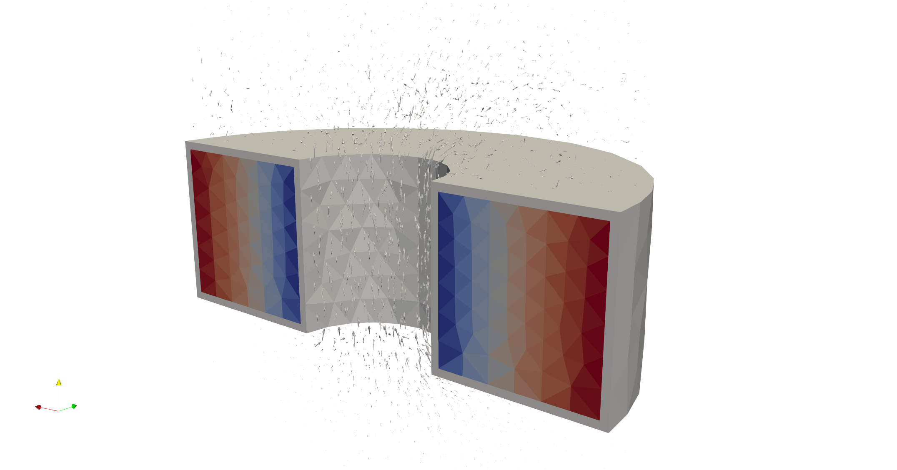

# 3D Open Foil Coil

This model depicts an inductor. The model simulates a foil multi-turn winding, wound around a magnetic core. The model is only half of the coil, which requires setting up the model as an open coil.

The model is solved as a transient and a harmonic problem, each in their respective directories.

