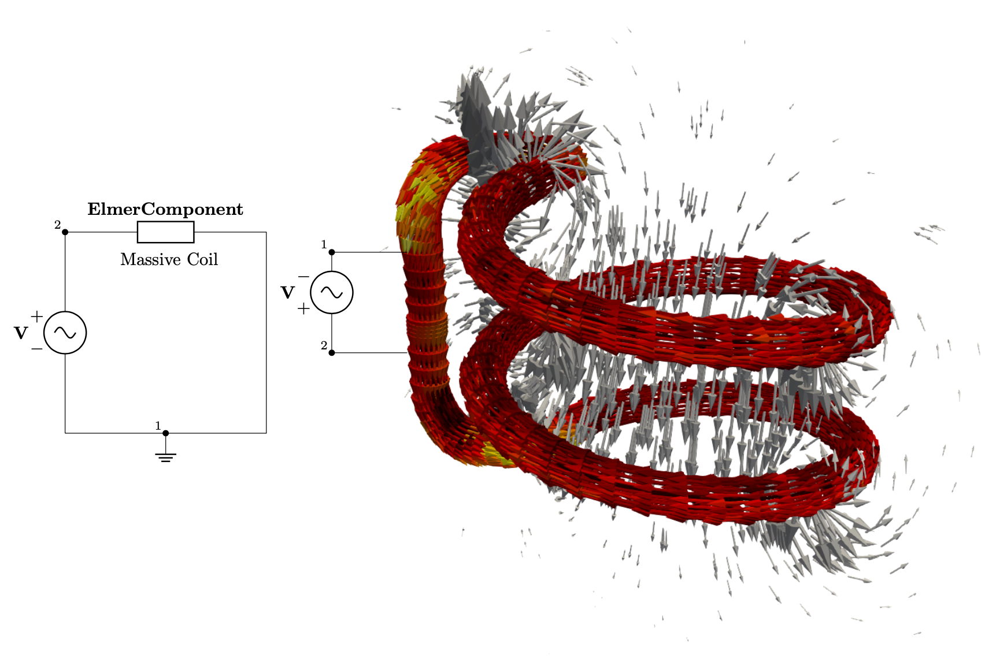

# 3D Closed Massive Coil

This model describes a massive 2-turn coil excited by a current source at 50Hz.

The model is solved as a transient and a harmonic problem, each in their respective directories.

