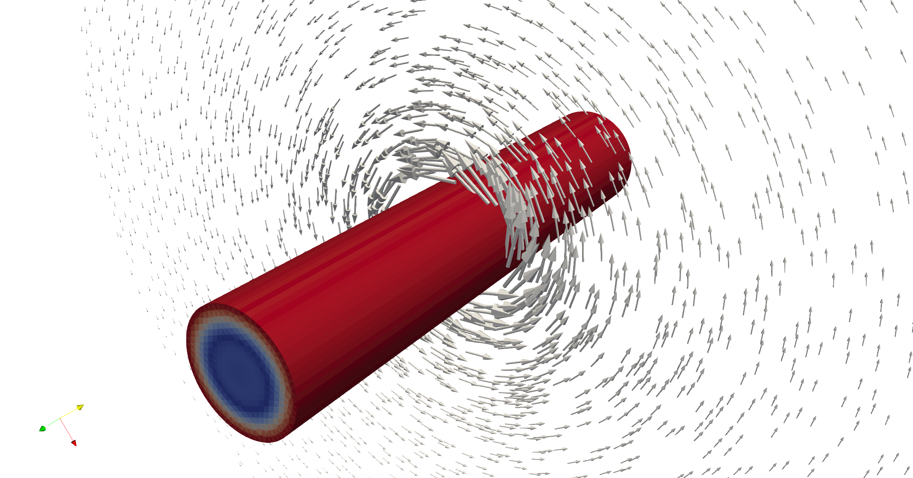

# 3D Open Massive Coil

This model shows how to model a 3D open massive-coil. In the open coil case the terminal boundaries need to be defined in the .sif file and the same indices will be used to setup the circuit connection

The model is solved as a transient and a harmonic problem, each in their respective directories. The voltage source is sinusoidal, excited at a frequency of 5kHz. Hence, skin and proximity effects can be observed. 

