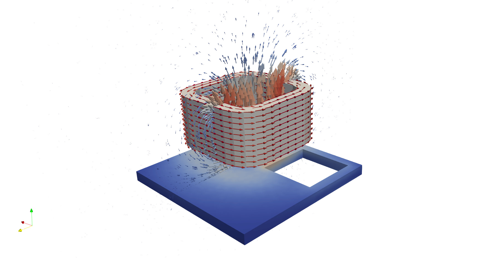

# 3D Closed Stranded Coil - TEAM7

TEAM (Testing Electromagnetic Analysis Methods) represents an open
international working group aiming to compare electromagnetic
analysis computer codes.

The TEAM 7 validation case consists of a thick aluminum plate with a hole,
which is placed eccentrically (asymmetric problem). The field is produced
by a coil with uniform current which varies sinusoidally with time

For more info see:
https://www.lstc.com/applications/em/test_cases/team

The model is solved as a transient and a harmonic problem, each in their respective directories.

