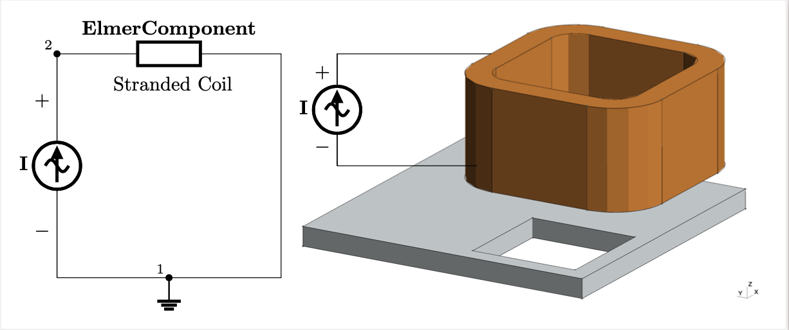

# What is the CircuitBuilder?
The Elmer CircuitBuilder is a Python library with components such as ideal sources(V,I), resistors(R), capacitors (C), and inductors (L) 
to streamline the creation of circuit networks and enable circuit-field simulations by building the stiffness and damping matrices needed.
The available Finite Element coil models in Elmer's component block are: massive, stranded and foil, in 2D and 3D. 

In this directory you'll find basic examples on how to model coils in Magnetodynamics applications using ElmerFem. 
Global sources (e.g., Ideal Voltage and Current Sources) can be added using electrical networks with the help of the elmer_circuitbuilder Python module. 



# Coil Models: Massive, Stranded, and Foil


## References
For information about massive, stranded and foil coil types:

&nbsp;&nbsp;  Patrick Dular, and Christophe Geuzaine. 
&nbsp;&nbsp;  <A HREF="https://ieeexplore.ieee.org/abstract/document/996165/">
&nbsp;&nbsp;  Spatially dependent global quantities associated with 2d and 3d &nbsp;&nbsp;  magnetic vector potential formulations for foil winding modeling</A>. 
&nbsp;&nbsp;  IEEE trans. magn., 38(2):633–636, March 2002.

&nbsp;&nbsp;  Patrick Dular, F. Henrotte, and W. Legros.
 <A HREF="https://ieeexplore.ieee.org/abstract/document/767310">
 A general and natural method to define circuit relations associated with magnetic vector potential formulations </A>. 
 IEEE trans. magn., 35(3):1630–1633, May 1999.

&nbsp;&nbsp;  Patrick Dular, Nelson Sadowski, J.P.A. Bastos, and Willy Legros. <A HREF="https://ieeexplore.ieee.org/abstract/document/877746">
Dual complete procedures to take stranded inductors into account in magnetic vector potential formulations</A>. 
IEEE trans. magn., 36(4):1600–1605, July 2000.

&nbsp;&nbsp;  H. D. Gersem and K. Hameyer. 
<A HREF="https://ieeexplore.ieee.org/abstract/document/952629">
A finite element model for foil winding simulation</A>. 
IEEE trans. magn., 37(5):3427–3432, September 2001.

The module to couple and solve circuit-field problems is the CircuitAndDynamics
Module. This module needs the stiffness and damping matrix definitions, for which the CircuitBuilder was created. For more information about the CircuitAndDynamics module:
<p>
<A HREF="http://www.nic.funet.fi/pub/sci/physics/elmer/doc/ElmerModelsManual.pdf#page=128">
CircuitAndDynamics Module Documentation </A>
</p>

If you use the CircuitAndDynamics module or the CircuitBuilder, please don't forget to cite the following references:

&nbsp;&nbsp; Eelis Takala, Evren Yurtesen, Jan Westerholm, Juha Ruokolainen, and Tommi Peussa. <A HREF="https://www.tandfonline.com/doi/pdf/10.1080/02726343.2016.1187107?casa_token=XTTKx7uW-RYAAAAA:xO33zf8Rwi7UccLiGx9ZjY2GaCRPFHHxRXbY-oQ1n8f54vJdkrNu4J0EvZJL4zQ8E-1zHVgx9cS3zQ">Using reduced support to enhance parallel strong scalability in 3d finite element magnetic vector potential formulations with circuit equations</A>. Electromagnetics, 36(6):400–408, August 2016.

&nbsp;&nbsp;  Eelis Takala, Evren Yurtesen, Jan Westerholm, Juha Ruokolainen, and Peter Råback. <A HREF="https://www.tandfonline.com/doi/pdf/10.1080/02726343.2016.1151616?casa_token=LQoOG9VNPsoAAAAA:OkFQpOERLVG9p14lAjhPtJinnoXdIFc6LgHk2ax411KZqqJPlQVfLxFUndwMCj9Mze5nTneC5sCFeA">Parallel simulations of inductive components with elmer finite element software in cluster environments</A>. Electromagnetics, 36(3):167–185, April 2016.


# How to Download the CircuitBuilder
To use and take advantage of the models in this directory go to Terminal and enter:

```
$ pip install elmer-circuitbuilder
```

# How does Elmer CircuitBuilder work?
After importing all the functions within the library into a fresh Python file (see main_template.py or main.py in each model), you can develop a circuit network 
using a common two-terminal component approach. 

The steps are simple. The idea is that following the main.py template on the examples in this directory you'd be able to create
your own circuit to model coils with ElmerFEM. The steps are summarized below.

Instructions: \
               1) Import the circuit builder library (from elmer_circuitbuilder import *) \
               2) Set output file name as a string (e.g output_file = "string_circuit.definitions") \
               3) Set number of circuits with number_of_circuits(n) (e.g c = number_of_circuits(1)) \
               4) Set your ground/reference node in the current circuit c[1].ref_node = pin_number \
               5) Select and configure electrical component \
                     Resistors (R), Inductors (L), Capacitors (C), Voltage Source (V), Current Source (I)
                     or FEM Component (ElmerComponent) 
                     Arguments needed for R, L, C, V, I is the same. ElmerComponent takes additional arguments\
               6) Add circuit components to circuit c[n].components.append([R1, V1, ElmerFemCoil, ...etc]) \
               7) Write circuits generate_elmer_circuits(c, output_file) \
               8) Output file must be included in .sif file 


The steps can be easily spotted on the following template

```
# Imported Libraries:
import sys
import os
from elmer_circuitbuilder import *                                       # STEP 1
# -----------------------------------------------------------------------------------------------------

def main(argv=None):

    # name output file - do not remove                                   # STEP 2
    output_file = ""

    # initialize circuits: number of circuits - do not remove            # STEP 3
    c = number_of_circuits(1)

    # reference/ground node needed - do not remove.                      # STEP 4
    c[1].ref_node = 1

    # ------------- Electrical Network Definition -------------          # STEP 5

    # Components

    # Define coil type: massive, stranded, foil

    # Define dimension related features if needed (closed, open)

    # store components in array components = [comp1, comp2,...] - do not remove
    c[1].components.append([])

    # --------------------------------------------------

    # generate elmer circuit.definitions - do not remove / do not edit   # STEP 6
    generate_elmer_circuits(c, output_file)                              # STEP 7

    return 0


if __name__ == "__main__":
    sys.exit(main() or 0)

```

Note that STEP 8 is not part of the template but rather on the .sif file itself as an include of the .definition file created by the CircuitBuilder

```
Include "<name_of_circuit>.definition"
```

