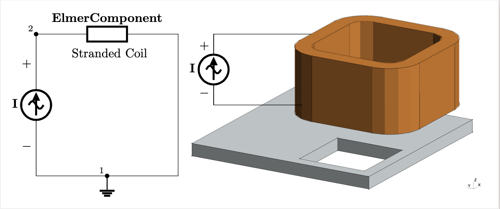

# What is the CircuitBuilder?
The Elmer CircuitBuilder is a Python library with components such as ideal sources(V,I), resistors(R), capacitors (C), and inductors (L) 
to streamline the creation of circuit networks and enable circuit-field simulations by building the stiffness and damping matrices needed.
The available Finite Element coil models in Elmer's component block are: massive, stranded and foil, in 2D and 3D. 

In this directory you'll find basic examples on how to model coils in Magnetodynamics applications using ElmerFem. 
Global sources (e.g., Ideal Voltage and Current Sources) can be added using electrical networks with the help of the elmer_circuitbuilder Python module. 



# How to Download the CircuitBuilder
To use and take advantage of the models in this directory go to Terminal and enter:

```
$ pip install elmer-circuitbuilder
```

# How does Elmer CircuitBuilder work?
After importing all the functions within the library into a fresh Python file (see main_template.py or main.py in each model), you can develop a circuit network 
using a common two-terminal component approach. 

The steps are simple. The idea is that after following the main.py template on the examples in this directory you'll be able to create
your own circuit to model coils with ElmerFEM. The steps are summarized below.

Instructions: \
               1) Import the circuit builder library (from elmer_circuitbuilder import *) \
               2) Set output file name as a string (e.g output_file = "string_circuit.definitions") \
               3) Set number of circuits with number_of_circuits(n) (e.g c = number_of_circuits(1)) \
               4) Set your ground/reference node in the current circuit c[1].ref_node = pin_number \
               5) Select and configure electrical component \
                     Resistors (R), Inductors (L), Capacitors (C), Voltage Source (V), Current Source (I)
                     or FEM Component (ElmerComponent) 
                     Arguments needed for R, L, C, V, I is the same. ElmerComponent takes additional arguments\
               6) Add circuit components to circuit c[n].components.append([R1, V1, ElmerFemCoil, ...etc]) \
               7) Write circuits generate_elmer_circuits(c, output_file) \
               8) Output file must be included in .sif file 

##  The CircuitBuilder Template
The steps can be easily spotted on the following template

```
# Imported Libraries:
import sys
from elmer_circuitbuilder import *                                                 # STEP 1
# -------------------------------------------------------------------------------

def main(argv=None):

    # name output file - do not remove                                             # STEP 2
    output_file = ""

    # initialize circuits: number of circuits - do not remove                      # STEP 3
    c = number_of_circuits(1)

    # reference/ground node needed - do not remove.                                # STEP 4
    c[1].ref_node = 1

    # ----------------------- Electrical Network Definition ---------------------  # STEP 5

    # Components

    # Define coil type: massive, stranded, foil

    # Define dimension related features if needed (closed, open)

    # store components in array components = [comp1, comp2,...] - do not remove    # STEP 6
    c[1].components.append([])                                 

    # ---------------------------------------------------------------------------

    # generate elmer circuit.definitions - do not remove / do not edit             # STEP 7
    generate_elmer_circuits(c, output_file)                              

    return 0


if __name__ == "__main__":
    sys.exit(main() or 0)

```

Note that STEP 8 is not part of the template but rather on the .sif file itself as an include of the .definition file created by the CircuitBuilder

```
Include "<name_of_circuit>.definition"
```

##  How to create Components (STEP 5)?

The components are created as objects I, V, R, L, C and/or, ElmerComponent.
The code is documented using Docstrings, hence, it's encouraged to use an IDE. Below you can see how the documentation can be retrieved by hovering over the object on PyCharm:

<p align="center">
  
  
</p>


##  How does the CircuitBuilder output look like?

The CircuitBuilder produces a .definition-extension file that includes the basic blocks to use circuit networks in FEM models using ElmerFEM. 

The output file is split into 4 sections: Parameters (1), Circuit matrices (2), Elmer Component Block (3), Elmer Body Force 1 (4) Block. The idea is that the user should only change the values in the Parameters block to modify coil parameters such as resistance, number of turns, etc., according to the coil type used.

See sample of a CircuitBuilder output file of a single stranded coil (See Component 1) driven by an ideal Current Souce (see Body Force 1):

```
! -----------------------------------------------------------------------------
! ElmerFEM Circuit Generated: November 02, 2021
! -----------------------------------------------------------------------------

! -----------------------------------------------------------------------------
! Number of Circuits in Model
! -----------------------------------------------------------------------------
$ Circuits = 1

! -----------------------------------------------------------------------------
! Parameters                                                                (1)
! -----------------------------------------------------------------------------

! General Parameters 
$ I1 = 10

! Parameters in Component 1: Coil1
$ N_Coil1 = 10	 ! Number of Turns
$ R_Coil1 = 0.1	 ! Coil Resistance
$ Ns_Coil1 = 1	 ! Sector/Symmetry Coefficient (e.g. 4 is 1/4 of the domain)
! -----------------------------------------------------------------------------
! Matrix Size Declaration and Matrix Initialization                         (2)
! -----------------------------------------------------------------------------
$ C.1.variables = 5
$ C.1.perm = zeros(C.1.variables)
$ C.1.A = zeros(C.1.variables,C.1.variables)
$ C.1.B = zeros(C.1.variables,C.1.variables)

! -----------------------------------------------------------------------------
! Dof/Unknown Vector Definition
! -----------------------------------------------------------------------------
$ C.1.name.1 = "i_I1"
$ C.1.name.2 = "i_component(1)"
$ C.1.name.3 = "v_I1"
$ C.1.name.4 = "v_component(1)"
$ C.1.name.5 = "u_2_circuit_1"

! -----------------------------------------------------------------------------
! Source Vector Definition
! -----------------------------------------------------------------------------
$ C.1.source.5 = "I1_Source"

! -----------------------------------------------------------------------------
! KCL Equations
! -----------------------------------------------------------------------------
$ C.1.B(0,0) = -1
$ C.1.B(0,1) = 1

! -----------------------------------------------------------------------------
! KVL Equations
! -----------------------------------------------------------------------------
$ C.1.B(1,2) = 1
$ C.1.B(1,4) = -1
$ C.1.B(2,3) = -1
$ C.1.B(2,4) = 1

! -----------------------------------------------------------------------------
! Component Equations
! -----------------------------------------------------------------------------
$ C.1.B(4,0) = 1


! -----------------------------------------------------------------------------
! Additions in SIF file                                                     (3)
! -----------------------------------------------------------------------------
Component 1
  Name = "Coil1"
  Master Bodies Name = Coil
  Coil Type = "Stranded"
  Number of Turns = Real $ N_Coil1
  Resistance = Real $ R_Coil1
 
  ! Additions for 3D Coil
  Coil Use W Vector = Logical True
  W Vector Variable Name = String CoilCurrent e
  Electrode Area = Real $ Ae_Coil1
End 

! -----------------------------------------------------------------------------
! Sources in SIF                                                            (4)
! -----------------------------------------------------------------------------

Body Force 1
  I1_Source = Variable "time" 
  	 Real MATC "I1"
End

! -----------------------------------------------------------------------------
! End of Circuit
! -----------------------------------------------------------------------------
```

Note that the input current source (I1_Source) under Body Force 1 is a constant value defined in the Parameter's section.

## Time dependent sources
We can add appropiate mathematical functions to include time-dependencies. See below how you can include a sinusoidal source by modifying the current source (I1_Source)

```
Body Force 1
  I1_Source = Variable "time" 
  	 Real MATC "I1*sin(omega*tx)"
End
```

## Harmonic sources
If you are working with sinusoidal sources you could benefit from defining your ideal sources as complex valued sources in your CircuitBuilder template
```
phase = np.radians(120)
I1 = I("I1", 2, 1, 1*np.exp(phase*1j))
```
This will output the real and imaginary values necessary to setup the given source

```
Body Force 1
  I1_Source re = Real $ re_I1*cos(phase_I1)
  I1_Source im = Real $ im_I1*sin(phase_I1)
End
```
# Coil Models


## Massive Conductors 

Massive conductors/inductors are simply solid material conductors. The conducting domain $\Omega_c$ is fully discretized and solved using the magnetodynamics av formulation. Hence, skin effect and proximity effects can be observed. For further information about massive inductors, please see references below.


<p align="center">
  

</p>

## Homogenization: Stranded, and Foil windings
In the case of models that involve multiple conducting filaments (multi-turn coils, stranded coils, etc) or foils/laminations, it is difficult to solve the magnetodynamics problem at a reasonable computational cost. Particularly, at higher frequencies the solution becomes computationally prohibitive. For that reason homogenization methods enable reasonable accuracy in quasi-static problems without the need to fully discretize the conducting domains (i.e. each turn).

<p align="center">
    
    
</p>

The stranded or foil winding can be modeled as a single material as shown below. The stranded model is actually modeled as part of the non-conducting domain, whereas the foil case is modeled as a single conductor just as you would do in the massive case. The difference lies in the formulation, which takes account of the different phenomena occuring in the particular case. For more information about stranded and foil windings see references below.

<p align="center">
  
</p>


## What are Closed and Open Coils?

In 3D we need to make a distinction between open and closed coils depending on the termination of the conductor. To the left you see that the closed coil has only one single (high) terminal, whereas the open coil has two: high and low terminals.

This distinction is relevant when setting up the circuit network and the finite element model, as modifications will be required to assign these surfaces with the appropiate boundary conditions in the .sif file. 


<p align="center">
    
      
</p>

When using the CoilSolver, some simplifications are made. In the case of a closed coil automatic cuts are made and no boundary conditions are needed (see image below). 

<p align="center">
      
</p>


If the coil is open, the boundary conditions need to be defined on each terminal of the conductor.

# elmer-elmag/CircuitBuilder directory

This directory includes general examples for classic coil types in frequency and time domain. 

The 2D directory has two types of examples. First general examples on how to add lumped circuit parameters to be part of a circuit network including a FEM component, and the other examples focus on the setup of massive, stranded and foil windings. 

```
2D/
├── circuit_examples
│   ├── current_divider
│   ├── current_source
│   ├── voltage_divider
│   └── voltage_source
├── foil
│   ├── harmonic
│   └── transient
├── massive
│   ├── harmonic
│   └── transient
└── stranded
    ├── harmonic
    └── transient
```


Similarly, the 3D directory includes general examples on the setup of massive, stranded and foil windings in transient and time harmonic cases.
```
3D/
├── foil
│   ├── closed
│   │   ├── harmonic
│   │   └── transient
│   └── open
│       ├── harmonic
│       └── transient
├── massive
│   ├── closed
│   │   ├── harmonic
│   │   └── transient
│   └── open
│       ├── harmonic
│       └── transient
└── stranded
    ├── closed
    │   ├── harmonic
    │   └── transient
    └── open
        ├── harmonic
        └── transient

```
# References
For information about massive, stranded and foil coil types:

<p>Patrick Dular, and Christophe Geuzaine. 
<A HREF="https://ieeexplore.ieee.org/abstract/document/996165/">
Spatially dependent global quantities associated with 2d and 3d &magnetic vector potential formulations for foil winding modeling</A>. 
IEEE trans. magn., 38(2):633–636, March 2002. </p>

atrick Dular, F. Henrotte, and W. Legros.
 <A HREF="https://ieeexplore.ieee.org/abstract/document/767310">
 A general and natural method to define circuit relations associated with magnetic vector potential formulations </A>. 
 IEEE trans. magn., 35(3):1630–1633, May 1999.

Patrick Dular, Nelson Sadowski, J.P.A. Bastos, and Willy Legros. <A HREF="https://ieeexplore.ieee.org/abstract/document/877746">
Dual complete procedures to take stranded inductors into account in magnetic vector potential formulations</A>. 
IEEE trans. magn., 36(4):1600–1605, July 2000.

H. D. Gersem and K. Hameyer. 
<A HREF="https://ieeexplore.ieee.org/abstract/document/952629">
A finite element model for foil winding simulation</A>. 
IEEE trans. magn., 37(5):3427–3432, September 2001.

The module to couple and solve circuit-field problems is the CircuitAndDynamics
Module. This module needs the stiffness and damping matrix definitions, for which the CircuitBuilder was created. For more information about the CircuitAndDynamics module:
<p>
<A HREF="http://www.nic.funet.fi/pub/sci/physics/elmer/doc/ElmerModelsManual.pdf#page=128">
CircuitAndDynamics Module Documentation </A>
</p>

If you use the CircuitAndDynamics module or the CircuitBuilder, please don't forget to cite the following references:

Eelis Takala, Evren Yurtesen, Jan Westerholm, Juha Ruokolainen, and Tommi Peussa. <A HREF="https://www.tandfonline.com/doi/pdf/10.1080/02726343.2016.1187107?casa_token=XTTKx7uW-RYAAAAA:xO33zf8Rwi7UccLiGx9ZjY2GaCRPFHHxRXbY-oQ1n8f54vJdkrNu4J0EvZJL4zQ8E-1zHVgx9cS3zQ">Using reduced support to enhance parallel strong scalability in 3d finite element magnetic vector potential formulations with circuit equations</A>. Electromagnetics, 36(6):400–408, August 2016.

Eelis Takala, Evren Yurtesen, Jan Westerholm, Juha Ruokolainen, and Peter Råback. <A HREF="https://www.tandfonline.com/doi/pdf/10.1080/02726343.2016.1151616?casa_token=LQoOG9VNPsoAAAAA:OkFQpOERLVG9p14lAjhPtJinnoXdIFc6LgHk2ax411KZqqJPlQVfLxFUndwMCj9Mze5nTneC5sCFeA">Parallel simulations of inductive components with elmer finite element software in cluster environments</A>. Electromagnetics, 36(3):167–185, April 2016.
