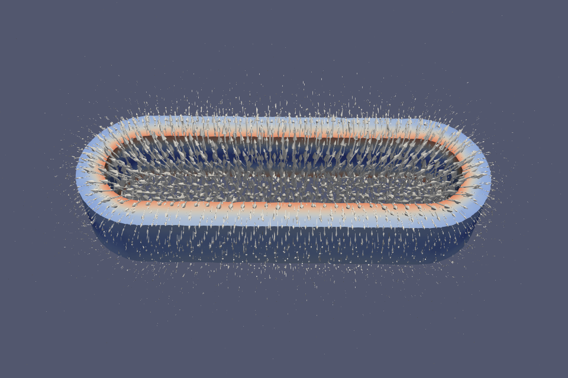

# Coil on a iron core

This is a test case initiated by "ftrillaudp" at the Elmer discussion forum.
For details about the history of the case see:

http://www.elmerfem.org/forum/viewtopic.php?p=22260#p22260

- CoilSolver for current density
- WhitneyAVSolver for magnetostatics
- StressSolver for displacement related to magnetic forces
- HeatSolver for temperature distribution
- Includes nonlinear B/H curve

