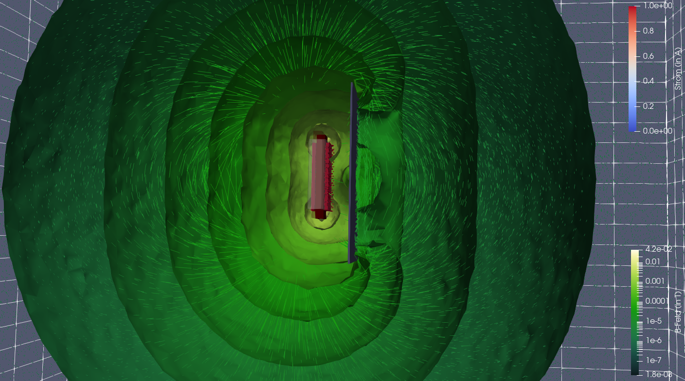
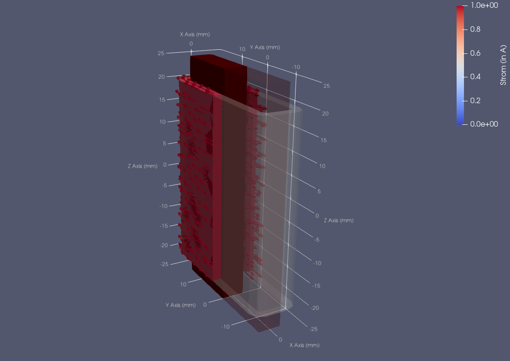
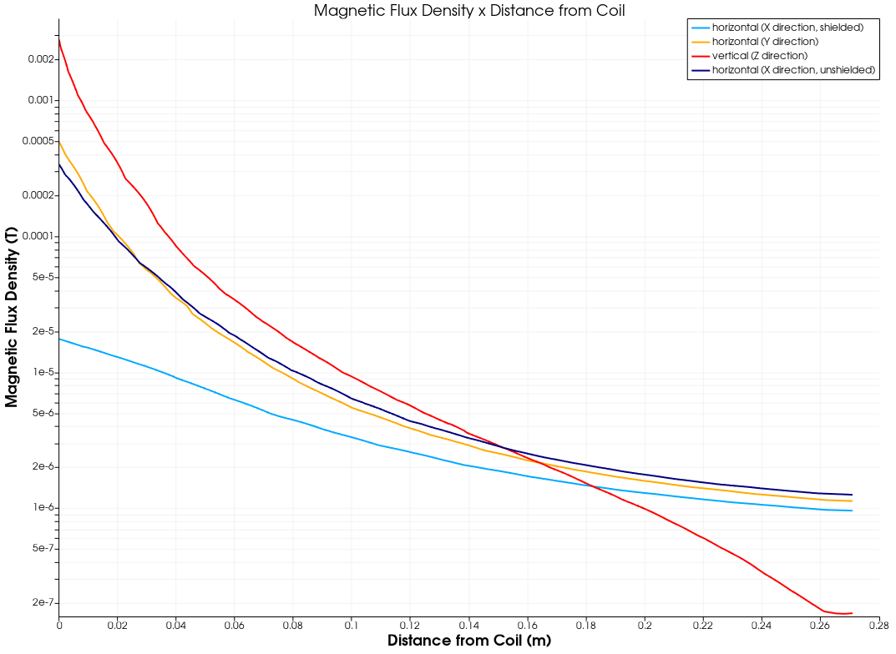
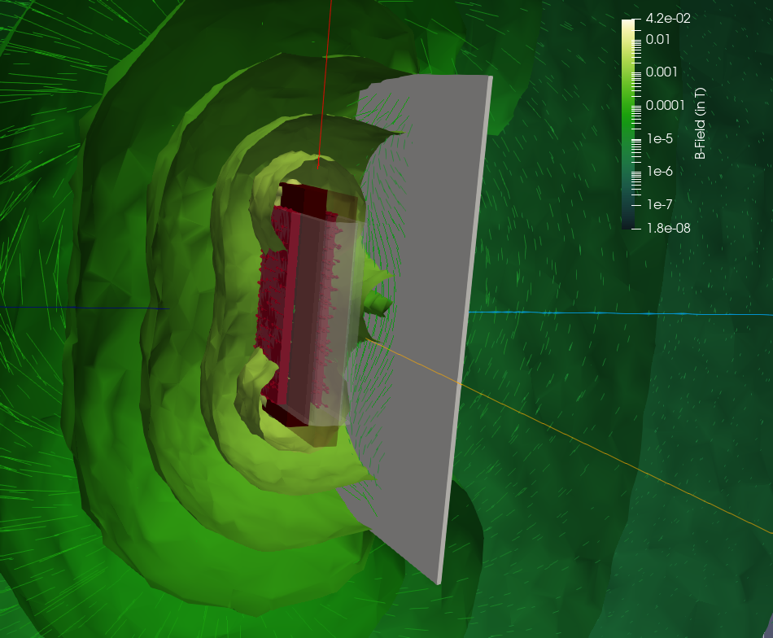

# Simulation of a Coil with Ferrite Core and a Ferrite Shielding Plate

This example shows how to simulate and visualize a static magnetic field generated by a coil
with a ferrite core and shielded by a ferrite plate.

The example shows off the following toolchain:
* [FreeCAD](https://freecad.org) for geometry modeling
* [GMSH](https://gmsh.info) to convert your CAD model into a Mesh
* [ElmerGrid/ElmerSolver](https://www.elmerfem.org/) to execute the simulation
* [ParaView](https://www.paraview.org/) to visualize results


# Geometry Modeling and Mesh Preparation

See the separate [README.md](geometry/README.md) in the geometry subfolder for details.


# Simulation and Graphical Analysis

Once Elmer and ParaView are installed and present on your local path execute the following
script to start the simulation and open ParaView with a pre-configured visualization pipeline.

```
> ./simulate-and-present.sh
```

If you want to play with the simulation results without re-running the solver, you
may start ParaView on the generated dataset directly:

```
> paraview --state=coil.pvsm
```

# Screenshots



Isosurfaces visualize the magnitude of the magnetic flux field (B field) on a logarithmic scale.
Field lines indicate the direction of B field vectors. Magnetic field lines close to the coil have
been removed with a threshold filter so that the coil remains visible.

The distortion of the isosurfaces demonstrates the shielding effect of a ferrite plate onto the
static magnetic field.



This visualization shows details of coil geometry including the current flow and current density inside
the coil.



ParaView allows for measurements along arbitrary paths within the simulation. The above plot
shows on a logarithmic scale how the magnitude of the flux field varies in the direction of
all co-ordinate axes. It also demonstrates the effect of shielding on the magnitude of the field.

See the below screenshot for a visualization of the axes along which measurements have been
taken. The axes' colors match those of the plot. This screenshot also shows the field lines
projected onto the shield.



More screenshots can be found in the [screenshots](screenshots/) folder.
