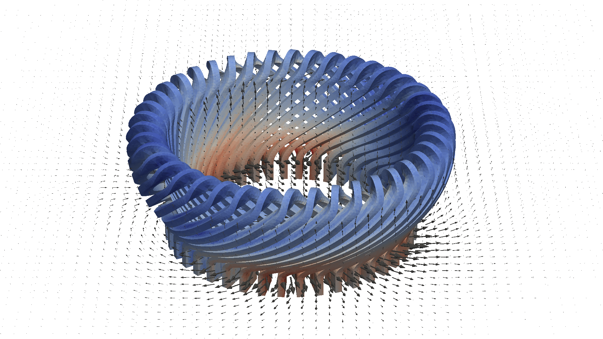

# End Windings of an electrical machine
Example case for complex appealing 3D geometry in electrostatics.

The model consists of stationary case of electrical machine end-windings.
The current densities may be computed either as hierarchical
or strongly coupled with the magnetic vector potential.
Hierarchical approach is more economical but does not account for the
effects of magnetic field on the current density. 

The models were initially prepared within the SEMTEC project during
years 2015--2017. Mesh was initially created by Mikko Lyly. 

