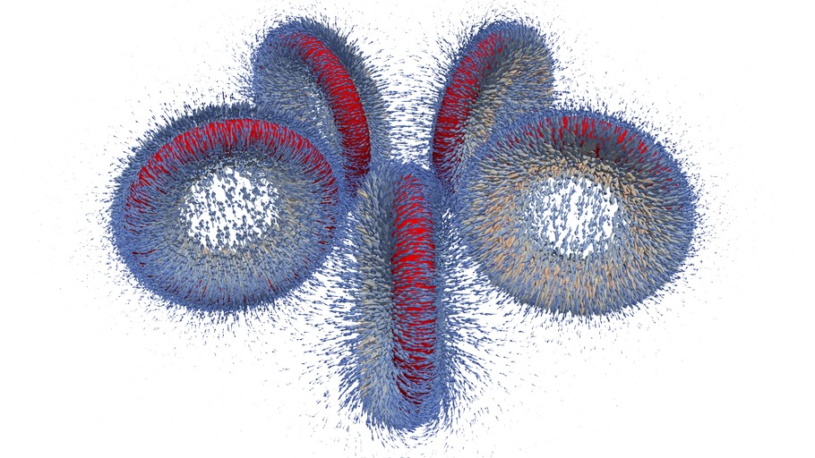

# Five Coils

This is a test case demonstrating how to set current density in five closed coils, see

http://www.elmerfem.org/forum/viewtopic.php?p=20334#p20334

Following solvers are used
- CoilSolver for current density
- WhitneyAVSolver for magnetostatics

There are multiple ways in Elmer to define coil currents in hierarchical
simulations for the Whitney AV solver to compute magnetic fields.
Basically one can give "Current Density i", i=1,2,3 or
"Electric Potential" which is used to internally compute the current sources in the AV solver.

Now the caveat of the given source is that they must be divergence free.
Elmer has built-in automated logic to do this but it only works for the given current density,
not for the potential. To control the fixing there is the keyword

> Fix Input Current density = True  

Since quite recently there is a possibility to also compute elemental fields of current density.
These basically utilize the discontinuous galerkin features of Elmer where each nodal value is
independent between elements. This avoids the intermediate and unnecessary projection to nodes
and seems to be very beneficial for the convergence of the linear system of the vector potential.

Attached is a simple case with five coils (including geo file for netgen). The coil currents
are generated automatically to the coil solver. Of all the choices the elemental currents works the best by far

> Current Density 1 = Equals "CoilCurrent e 1"  
> Current Density 2 = Equals "CoilCurrent e 2"  
> Current Density 3 = Equals "CoilCurrent e 3"  

The nodal values are not nearly as good 