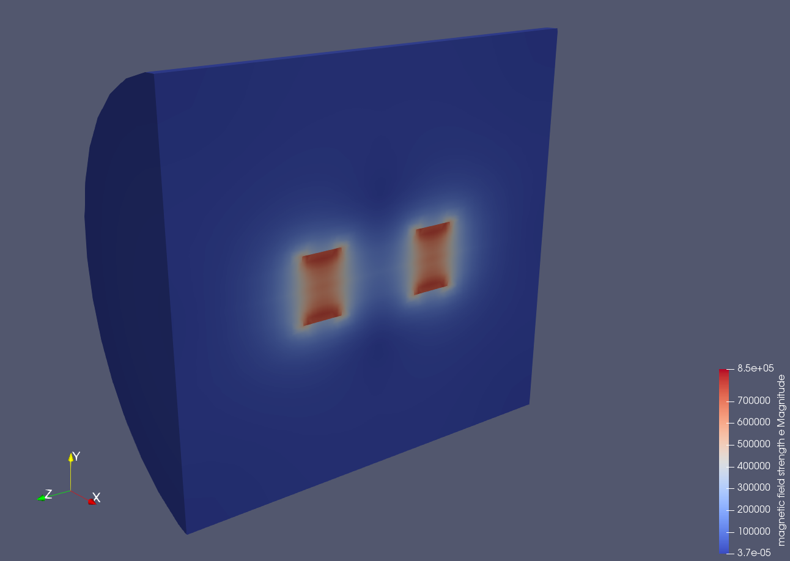

# Force between two cylindrical magnets 

This is a test case initiated by "JanHoek" at the Elmer discussion forum.
There is a 2D and 3D version of the case. 
For details about the history of the case see:

http://www.elmerfem.org/forum/viewtopic.php?f=3&t=6959

- WhitneyAVSolver for magnetostatics used in 3D
- MagnetoDynamics2D used in 2D

