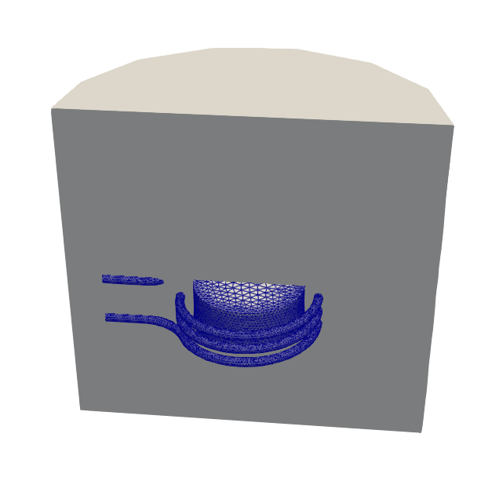

# Induction heating

:warning: This case is still under development. :warning:

Induction heating of a graphite cylinder in an open copper coil.

## Setup

Boundary conditions:

- potential of +- 10 V at coil ends
- potential of 0 at outside of domain
- radiation to ambient at cylinder surface

## Solvers

- CoilSolver
- WhitneyAVHarmonicSolver
- HeatSolver

