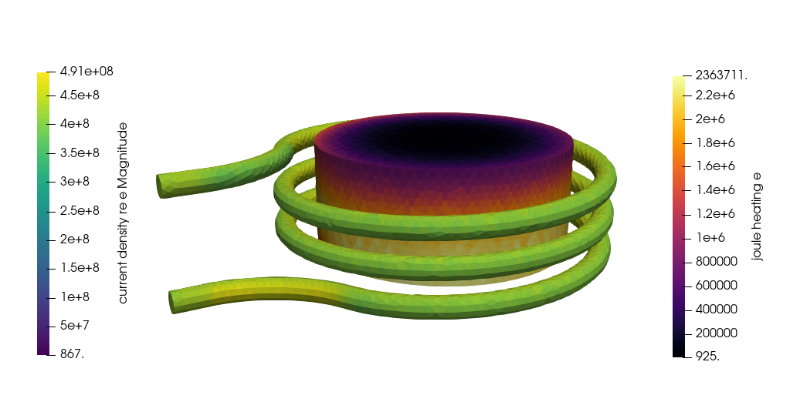

# Induction heating

Example for 3D steady-state induction heating modeling. ElmerSolver based on [this commit (Oct 7, 2022)](https://github.com/ElmerCSC/elmerfem/commit/0ff29c7213bfe81ab9f79de7650118d69bec1ab4) or later is required to run all cases.

## Setup

### Geometry

The setup consists of a graphite cylinder in an open massive copper coil. The mesh is generated using Gmsh and consists of 228,962 tetrahedra. The skin layer of the current on the coil surface is not resolved.

The coil inner diameter is 140 mm, the graphite cylinder has a diameter of 120 mm and height of 50 mm. The surrounding domain has a diameter of 263 mm and height of 383 mm. The model is similar to the geometry shown in [this paper](https://doi.org/10.1016/j.jcrysgro.2022.126750).

### Electromagnetical simulation parameters

A frequency of 13.5 kHz with a total inductor current of 100 A is applied.

### Thermal simulation parameter

Only a dummy heat solver is used: the cylinder is heated inductively, its heat is transferred by conduction trough the air to the coil / outside boundary, where a temperature of 20°C is set.

## Implementations

There are various approaches to simulate induction heating in Elmer. The straight-forward approach would be to resolve the skin layer of the electric current in the inductor. However, this requires a very fine mesh and would be inefficient. Here, implementations without resolved skin layer are presented.

### CoilSolver

In the setup [case_coil-solver.sif](./case_coil-solver.sif) we use *CoilSolver* to compute a current density vector field which has known total flux over the ends. It is then used to initialize the *WhitneyAVHarmonicSolver*. Note that this solver requires a reduced electric conductivity in the coil to avoid spurious self-induction. It is set to 1 S/m, as the coil solver does not allow for an electric conductivity of 0 S/m.

### Scaled conductivity

In the setup [case_scaled-conductivity.sif](./case_scaled-conductivity.sif) we assume massive coil. Unfornately then the current would be with realistic parameters very much only on the skin of the coil. This requires impratical meshes and is not really feasible. Hence we scale down the electric conductivity of the coil and use current density BCs with "-distribute" pragma to define the current. The user may experiment how high conductivity may be used.

### Layer conductivity / impedance boundary condition

In the setup [case_layer-conductivity.sif](./case_layer-conductivity.sif) we assume that the frequency is such high that the current density in the inductor only recides on the boundary as the skin depth is so small. Therefore, we set the electic conductivity in the inductor to zero and model the surface current with a so-called impedance boundary condition on the inductor surface (keyword *Layer electric conductivity*). In order to be able to set Neumann BCs for the end of the skin we need to create line BCs on the fly as intersection of two surface BCs. Note that the layer BCs activate the computation of surface currents. No volume currents are postprocessed due to the layer BCs. Unfortunately the convergence of the solution is not too good. This should however provide a basis for critical comparison between different methods. The following figure should be updated to follow the correction of [the commit](https://github.com/ElmerCSC/elmerfem/commit/3dd3353f03e636030da540f75225991cd94a1309).

### Circuit

In the setup [case_circuit.sif](./case_circuit.sif) a circuit model is used to model a power supply of 20 V. The circuit is defined in [harmonic_open3Dmassive_circuit.definition](./harmonic_open3Dmassive_circuit.definition).
Note, that this case would require a resolved skin layer to give a reliable result. Solving this case is computational very expensive.

### Experimental: Circuit with impedance boundary condition

In the setup [case_circuit_impedance-bc.sif](./case_circuit_impedance-bc.sif) a circuit model is used to model a power supply of 20 V in combination with an impedance boundary condition. The circuit is defined in [harmonic_open3Dmassive_circuit.definition](./harmonic_open3Dmassive_circuit.definition).

A solver based on https://github.com/ElmerCSC/elmerfem/blob/circuit_driven_BC is required to solve this case.
