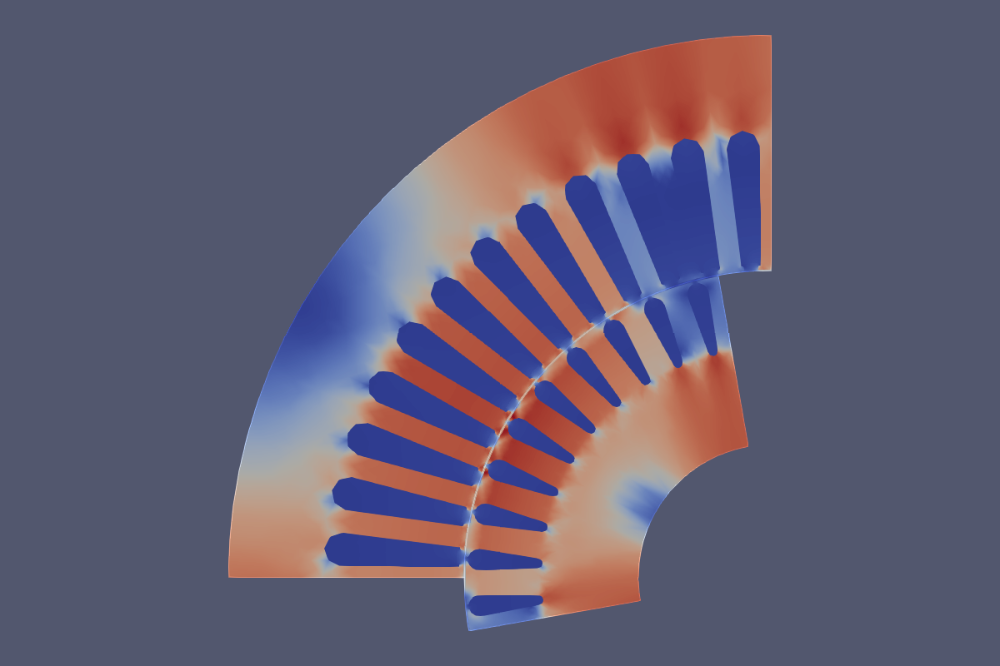

# Elmer_IM2D_cases
Example cases for 2D IM modelling in Elmer.

The model consists of 90-degrees sector of IM cross-section representing one 
magnetic pole. 

Example 2D cases demonstrate typical workflow from very simple static model, through time-harmonic and time-transient simulations with kinematics and electrical circuit couplings and iron losses calculation. Addtionally, a 2.5D multi-slice model is given to account for the axial skew. 

The 2D Induction Machine example describes the static, harmonic and time dependent case, as well as serial and parallel solution of the problem using Elmer. The original model and tutorial can be found on: https://www.researchgate.net/publication/317012206_SEMTEC_Report_Elmer_FEM

The models are prepared within the SEMTEC project during years 2015--2017.

