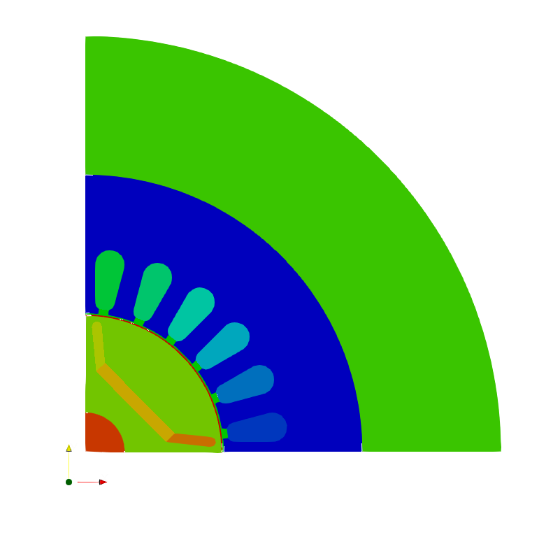
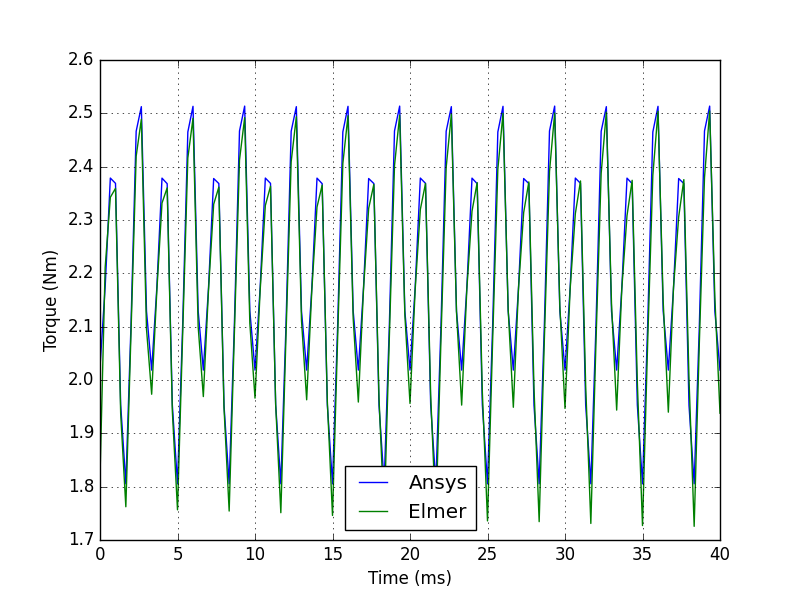
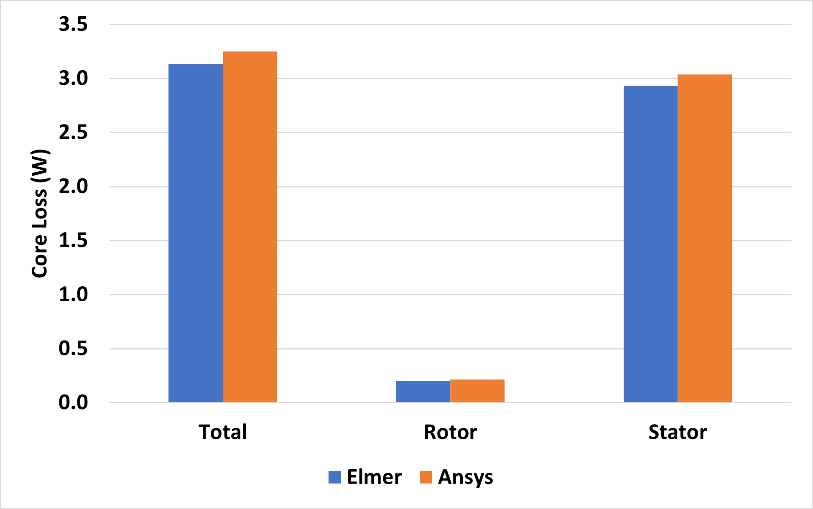
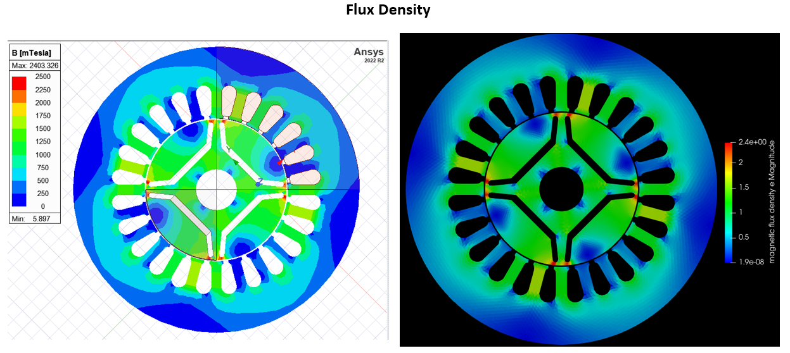
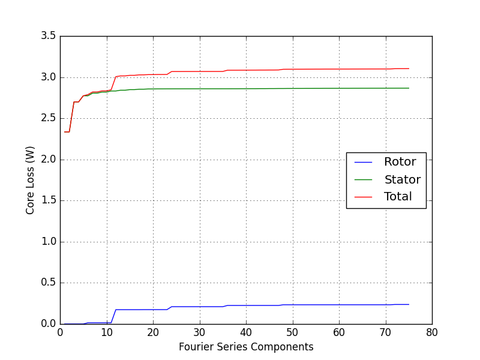

# Elmer Permanent Magnet Motor 2-D case
Example case for 2-D modelling of an Interior Permanent Magnet (IPM) motor in Elmer.

The model geometry is based on [this paper](https://ieeexplore.ieee.org/document/8673771) by Sasaki & Igarashi. It is a 4-pole IPM with 24 stator slots. By taking spatial periodicity and antiperiodicity into account, the motor could be modelled as a 90° sector.

A transient simulation was run and torque and core losses were compared against the results of the commercial solver Ansys Maxwell. The average torque differs by 1.5 %, while the core loss averaged over one electrical period differs by ~3.7 %.

The figure below shows how the core loss varies with the number of Fourier Series Components considered by the FourierLossSolver. It has to be set to at least half the number of stator slots to include the flux density fluctuations on the rotor caused by the stator slots.

