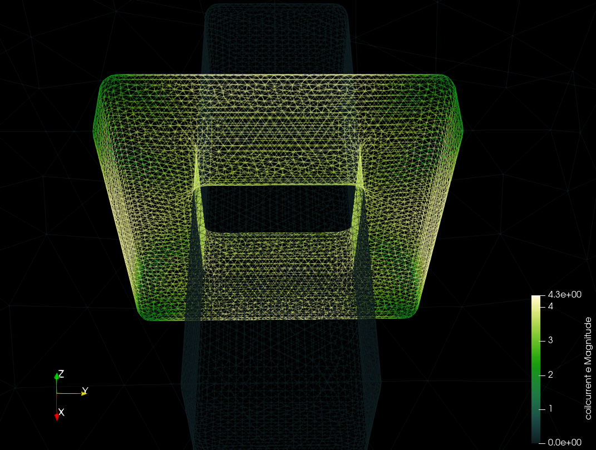

# Solenoid & current fixing

This example is inspired by the conclusion of [this thread](http://www.elmerfem.org/forum/viewtopic.php?t=8260) on the Elmer forums.

The geometry comprises:
- a 3x1x1 cuboid of 'steel', modelled as a material with relative permeability of 5000
- a closed 'coil' around (and conformally touching) the steel
- an airbox filling the rest of space

The original issue in the thread was finding that the `Fix Input Current Densities` on the `WhitneyAV` solver would create non-zero current density in the air and steel.
This resulted in unphysical "vortices" in the calculated B-field within the steel.

The important aspects of resolving this case were:

- Use the `Fix Input Current Densities` feature of the `CoilSolver`, and disable it on `WhitneyAV`
- Fillet the coil geometry to avoid sharp corners; otherwise the solver would not converge

Calculated `coilcurrent e`:

Calculated `magnetic flux density e`:

