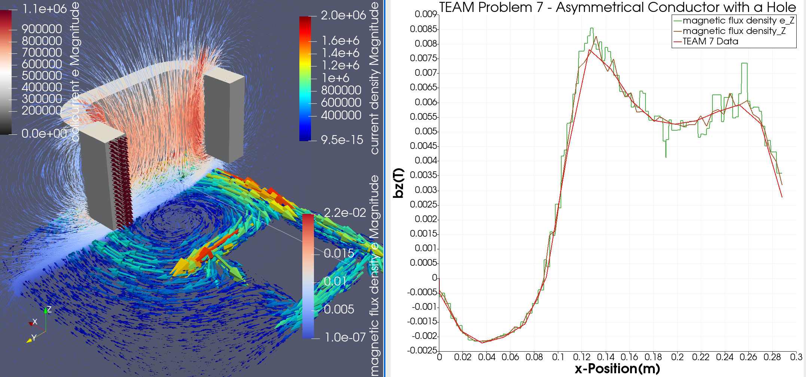

# TEAM7

TEAM (Testing Electromagnetic Analysis Methods) represents an open
international working group aiming to compare electromagnetic
analysis computer codes.

The TEAM 7 validation case consists of a thick aluminum plate with a hole,
which is placed eccentrically (asymmetric problem). The field is produced
by a coil with uniform current which varies sinusoidally with time

For more info see:
https://www.lstc.com/applications/em/test_cases/team

Case setup by Jonathan Velasco, CSC. 

1) Procedure = "CoilSolver" "CoilSolver"

Solves the current density in a closed coil at a fixed desired total current (Desired Coil Current).

2) Procedure = "MagnetoDynamics" "WhitneyAVSolver"

Takes the current density solved in the previous step and solves the A-v formulation including conducting and non-conducting domains.

3)Procedure = "ResultOutputSolve" "ResultOutputSolver"

Exports the solution of the field problem to be displayed in Gmsh and Vtu (Paraview) formats

Find description of the problem under TEAM7_ProblemDescription.pdf
See results using ElmerSolver under TEAM7_Results.png
Find data used under TEAM7_A1B1.csv 

